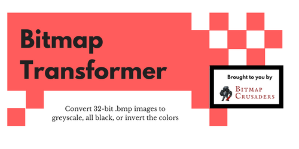

# Bitmap Transformer Documentation

## Project Description
Using JavaScript and Node.js, this program converts 32-bit bitmap images to greyscale, blackout (all black pixels), and inverted colors. :art: Using our code as a base, you can also create your own image conversions or custom filters by adjusting our transform.js file.  

# Table of Contents
+ [Features](#features)
+ Installation
+ How we made it
+ Who are the Bitmap Crusaders?

## Features:
Something something

## Installation
`npm something or other guys we need to fill this in`

## Usage
Our program automatically creates three converted images for you, which are written into the assets file.

1. Save a 32-bitmap image to the assets folder, with the name palette-bitmap.bmp - this is the image you want to convert.
2. With Node.js installed, run in terminal:

`node index.js`

3. Converted images (greyscale, blackout, and inverted colors) are written to /assets. Enjoy!

## How we made it
Some exciting text here about our process

## Who are the Bitmap Crusaders?
Gavin, Michelle, and Shaun are currently taking Code 401 (Full Stack JavaScript) at Code Fellows in Seattle, WA. They constructed this project in their first week of class. Want to learn more about them? Visit their LinkedIn profiles:
(icon) (icon) (icon)
